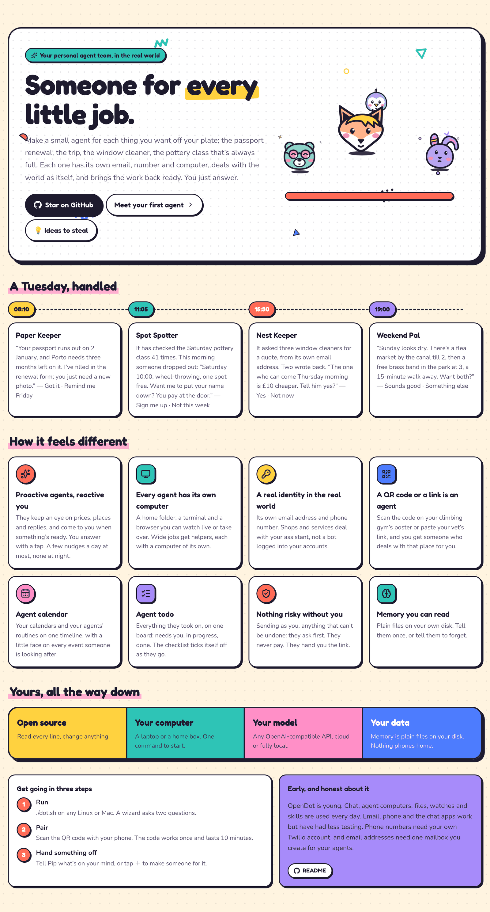

<div align="center">


# OpenDot

### Your personal agent team, in the real world.

[](LICENSE)
[](#-get-going)
[](README.zh-CN.md)

**English** · [中文](README.zh-CN.md)

</div>



---

## 👀 See it

<table>
<tr>
<td width="50%" valign="top"><br/><b>They come to you; you answer with a tap</b></td>
<td width="50%" valign="top"><br/><b>Every agent has its own computer</b></td>
</tr>
<tr>
<td width="50%" valign="top"><br/><b>Its own email address and phone number</b></td>
<td width="50%" valign="top"><br/><b>From a sentence, a template, a link or a QR code</b></td>
</tr>
<tr>
<td width="50%" valign="top"><br/><b>Your calendars and their plans, one timeline</b></td>
<td width="50%" valign="top"><br/><b>Everything they took on, on one board</b></td>
</tr>
</table>


<sub>Email works through one mailbox you give your agents: each gets an alias on it (like <code>you+pip@gmail.com</code>). Best to open a fresh mailbox just for them, so they never see your personal mail.</sub>

---

## 🛡️ You stay in charge

- **A second look.** Before an agent sends, posts or changes anything in your name, a separate check compares it with what you asked. Once you say "don't ask me" for something, it only steps in to stop what's clearly wrong.
- **Some things are always yours:** payments, passwords, deleting accounts, contracts.
- **Apps go only to the agents you choose.** They can look things up; adding or changing anything asks you first.
- **Nothing is lost** if the computer restarts.

---

## 🦊 Faces and colours


---

## 🚀 Get going

```bash
git clone https://github.com/thinkwee/OpenDot && cd OpenDot
./dot.sh
```

It installs everything, asks which AI to use, and opens OpenDot in your browser. For your phone, run `./dot.sh link`.

Then connect the apps you use under **Settings → Apps**: Notion, Gmail, Google Calendar or iCloud, Outlook, Todoist, Linear and more, most with one tap.

macOS or Linux, any AI model: OpenAI, Claude, Gemini, DeepSeek, or one on your own computer.

More: [how it works](docs/DESIGN.md).

---

## 🧭 Where this comes from

Personal agents aren't new, but in September 2026 a new wave took them a step further into the real world: **Meta Muse**, **Manus Cue** and **OpenAI Dot** give people agents that work in the background on their own computer, and some give each agent its own email and phone number.

OpenDot is an independent, open-source personal agent team in the real world that you run yourself: your computer, your model, your data. It isn't affiliated with any of them.

---

<div align="center">

If your agents took something off your plate, a ⭐ makes them do a happy dance.


<sub>MIT © 2026 thinkwee</sub>

</div>
