<div align="center">


# OpenDot

### Your personal agent team, in the real world.

Each agent takes one thing off your plate and deals with the world as itself,<br/>
with its own email, phone and computer. It comes back when there's something to decide. **You just answer.**

[](LICENSE)
[](#-get-going)
[](README.zh-CN.md)

**English** · [中文](README.zh-CN.md)

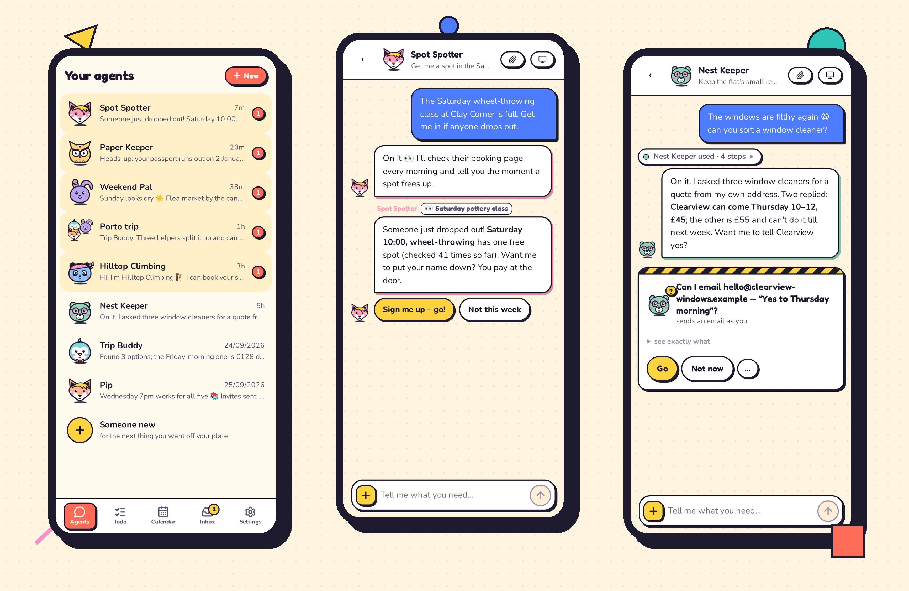

**💳 Your money stays yours.** Agents never pay for anything. They get everything ready and hand you the link.

</div>

---

## ✨ Six ideas

<table>
<tr>
<td width="46%" valign="top">

### 1 · Proactive agents, reactive you
They keep watch and come to you when something's ready. You answer with a tap. Quiet by default.

</td>
<td width="54%">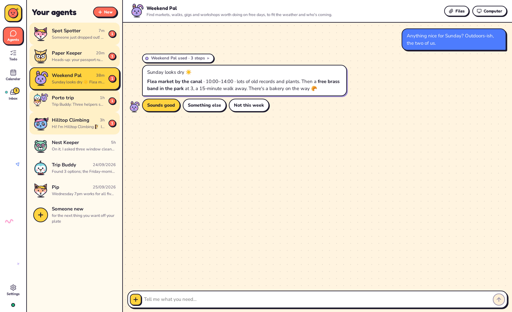</td>
</tr>
<tr>
<td width="54%">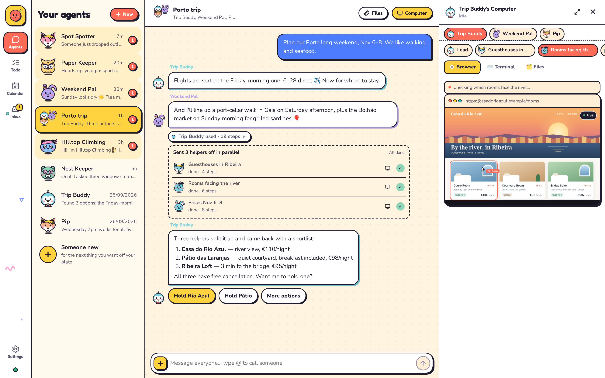</td>
<td width="46%" valign="top">

### 2 · Every agent has its own computer
A browser, files and a terminal you can watch live or take over. Big jobs get helpers, each with a computer of its own.

</td>
</tr>
<tr>
<td width="46%" valign="top">

### 3 · A real identity
Each agent can have its own email address and phone number, and deals with the world as itself, not as you.

<sub>Email works through one mailbox you give your agents: each agent gets an alias on it (like <code>you+pip@gmail.com</code>). Best to open a fresh mailbox just for them, so they never see your personal mail.</sub>

</td>
<td width="54%">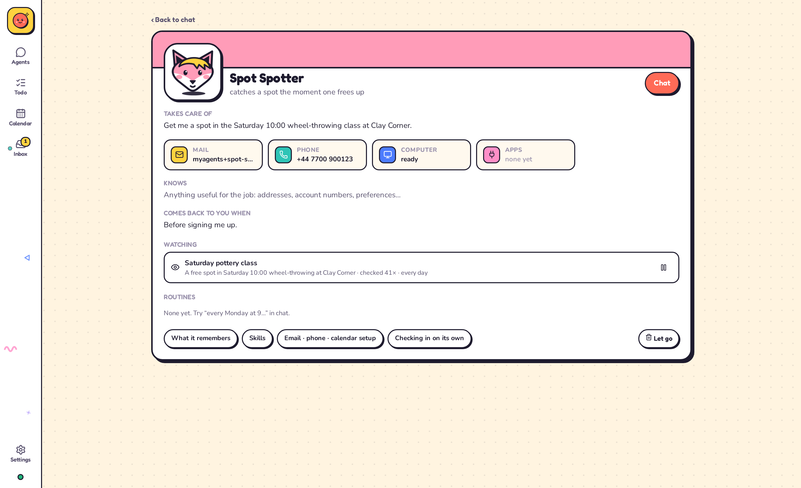</td>
</tr>
<tr>
<td width="54%">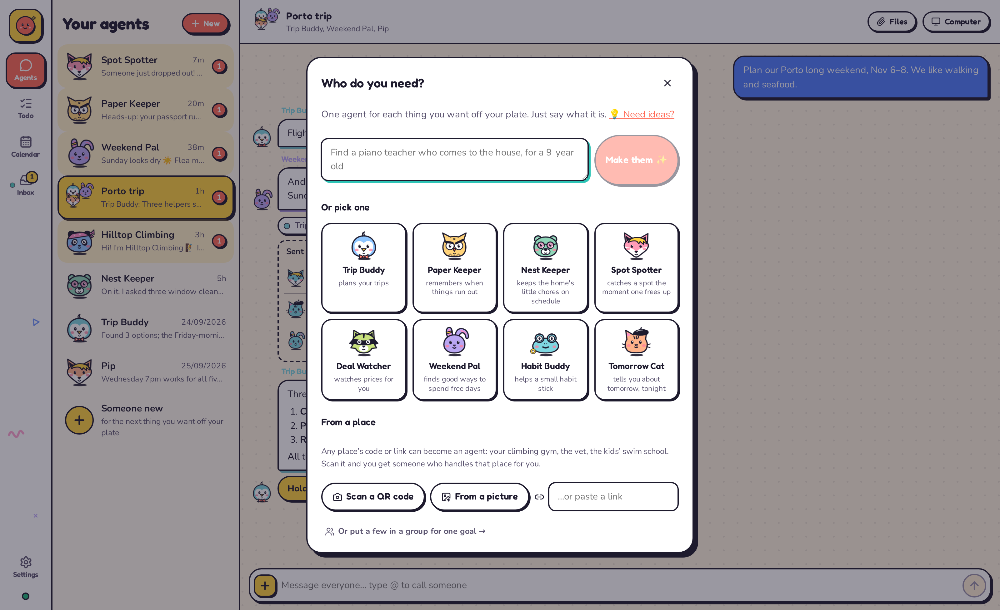</td>
<td width="46%" valign="top">

### 4 · A QR code or a link is an agent
One job, one agent. Make one from a sentence, a template, a link or a QR code.

</td>
</tr>
<tr>
<td width="46%" valign="top">

### 5 · Agent calendar
Your calendars and your agents' plans on one timeline, with a face on every event someone is looking after.

</td>
<td width="54%">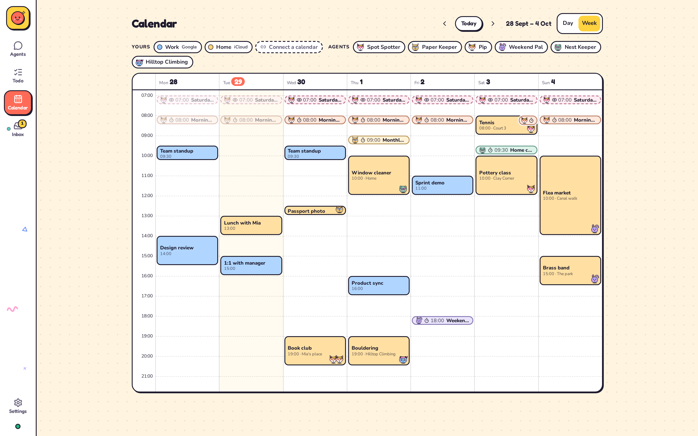</td>
</tr>
<tr>
<td width="54%">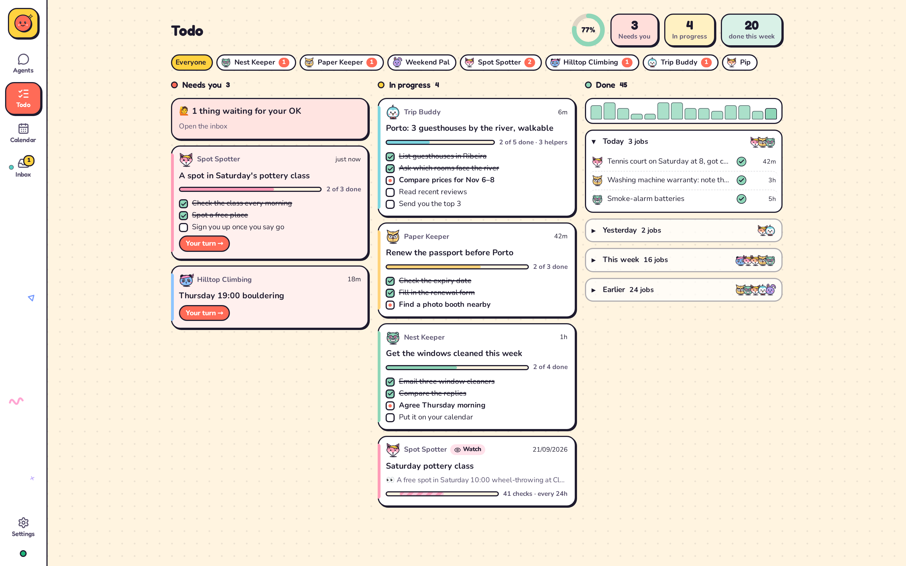</td>
<td width="46%" valign="top">

### 6 · Agent todo
Everything they took on, on one board: needs you, in progress, done.

</td>
</tr>
</table>

<p align="center">
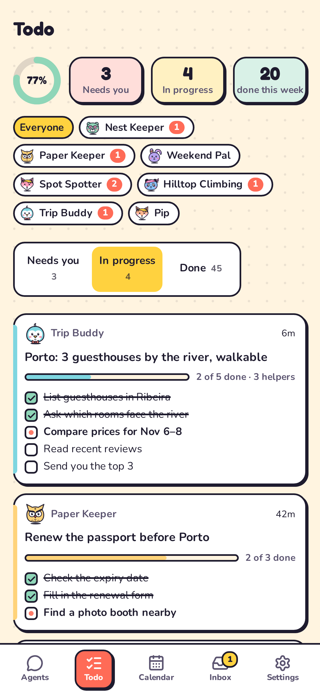
&nbsp;
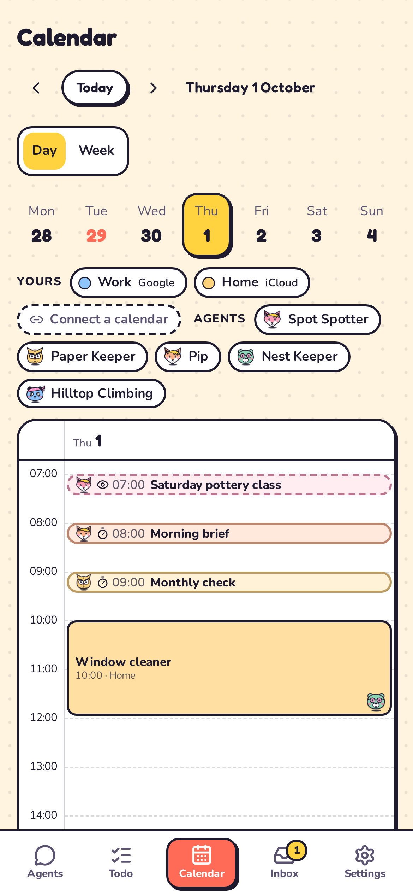
</p>

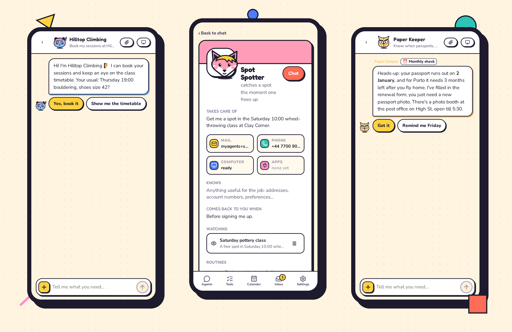

---

## 🛡️ You stay in charge

- **Nothing goes out in your name without asking.** Emails, texts and posts wait for your OK, and get a second look first.
- **Some things are always yours:** payments, passwords, deleting accounts, contracts.
- **Your data stays on your computer**, in plain files you can read.
- **Nothing is lost** if the computer restarts.

---

## 🦊 Faces and colours

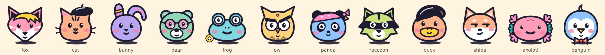

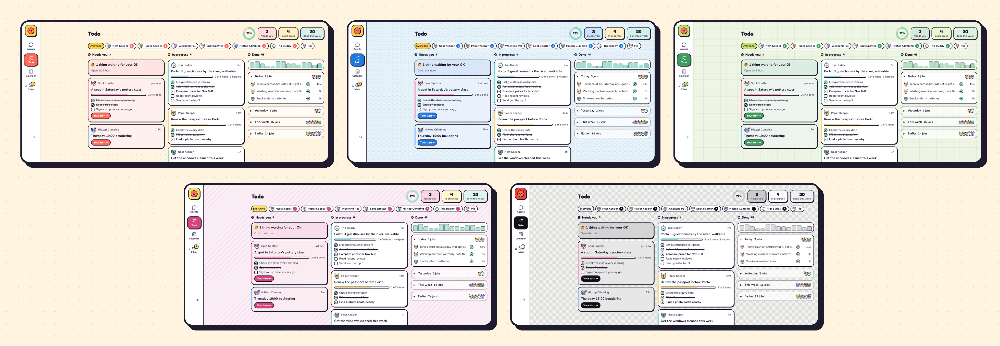

---

## 🚀 Get going

```bash
git clone https://github.com/thinkwee/OpenDot && cd OpenDot
./dot.sh
```

It installs everything, asks which AI to use, and opens OpenDot in your browser. For your phone, run `./dot.sh link`.

Works on macOS and Linux, with any AI model: OpenAI, Claude, Gemini, DeepSeek, or one running on your own computer. English and 中文.

More: [how it works](docs/DESIGN.md).

---

## 🧭 Where this comes from

Personal agents aren't new, but in September 2026 a new wave took them a step further into the real world: **Meta Muse**, **Manus Cue** and **OpenAI Dot** give people agents that work in the background on their own computer, and some give each agent its own email and phone number.

OpenDot is an independent, open-source personal agent team in the real world that you run yourself: your computer, your model, your data. It isn't affiliated with any of them.

---

<div align="center">

**Early, and honest about it.** If your agents took something off your plate, a ⭐ makes them do a happy dance.


<sub>MIT © 2026 thinkwee</sub>

</div>
