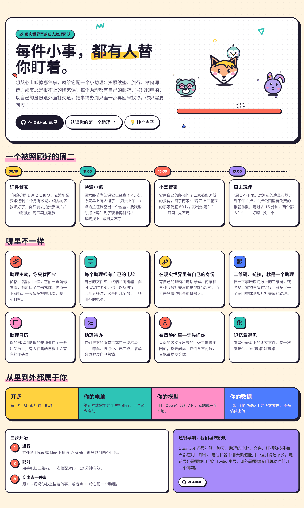
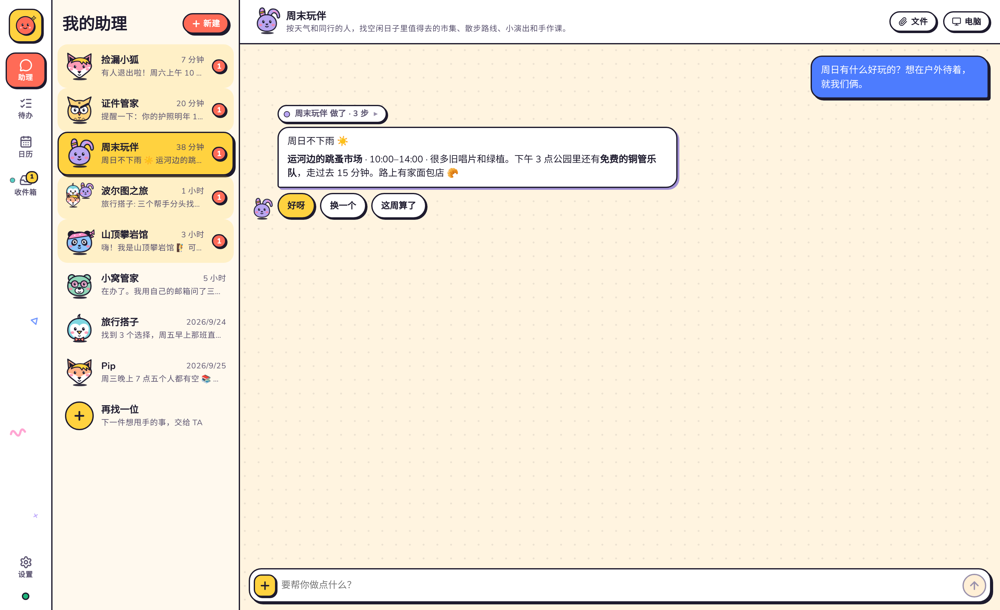
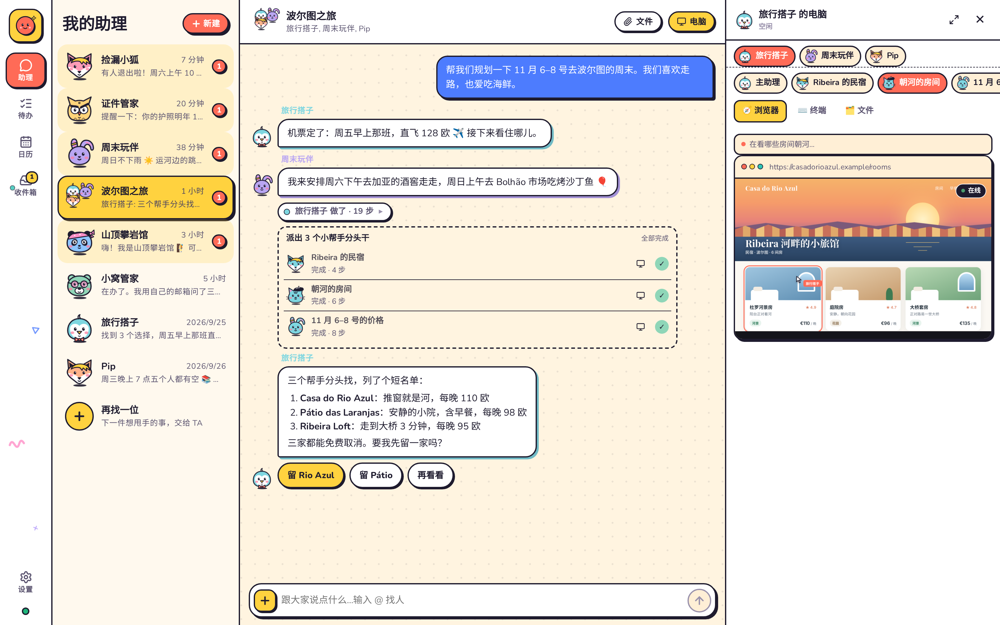
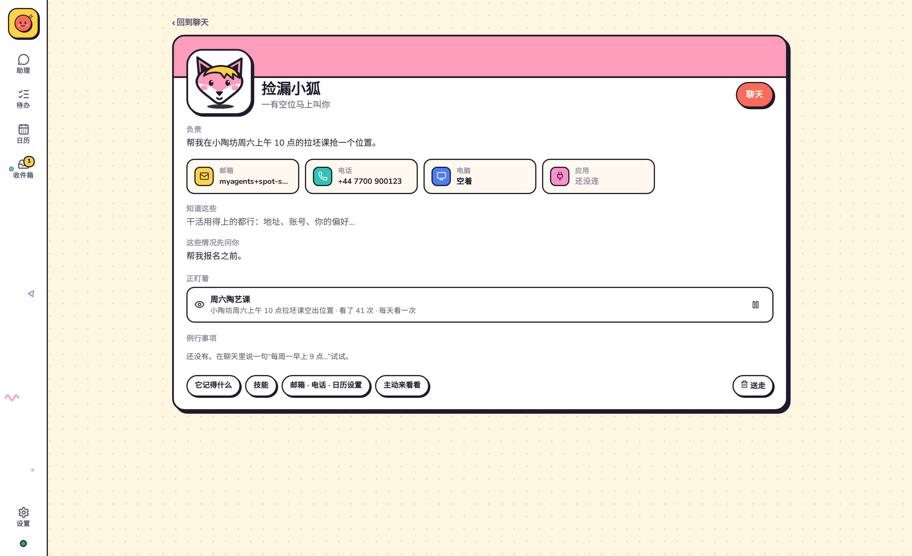
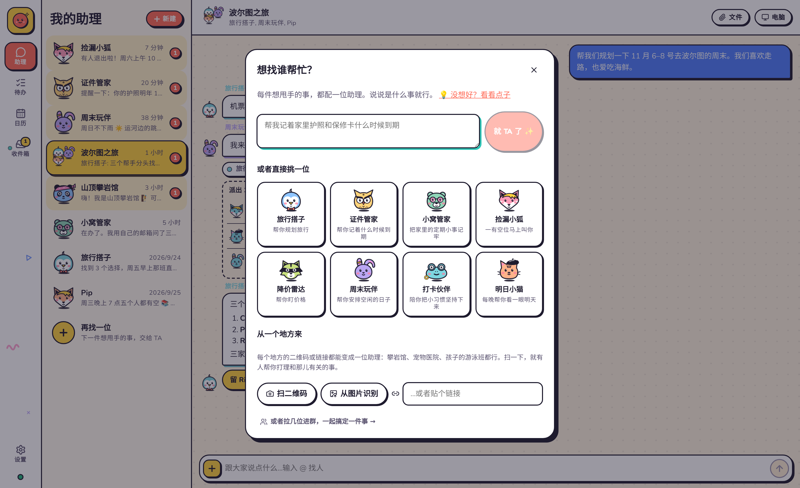
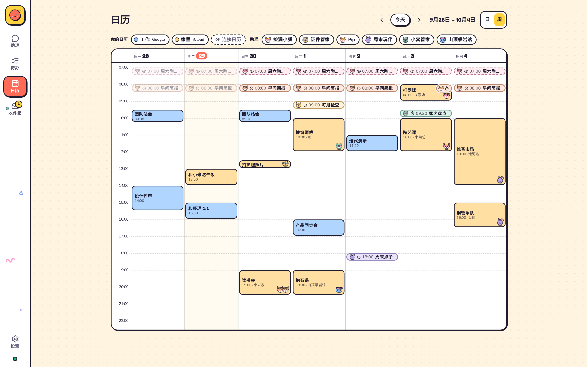
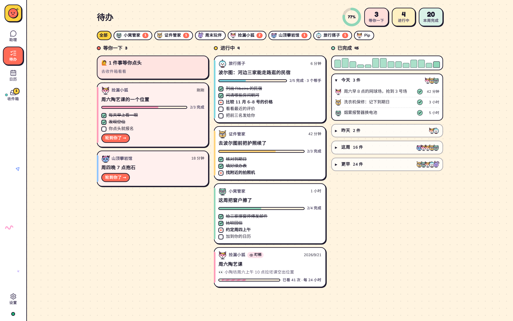
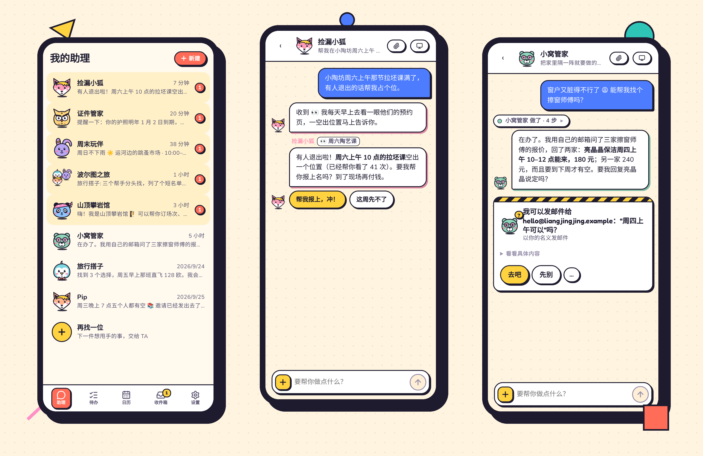
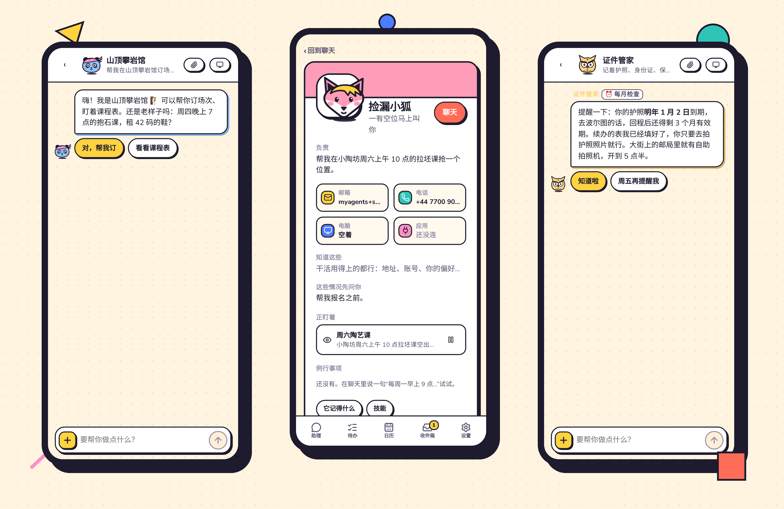

<div align="center">


# OpenDot

### 你在现实世界里的私人助理团队。

[](LICENSE)
[](#-三步开始)
[](README.md)

[English](README.md) · **中文**

</div>



---

## 👀 看看实际样子

<table>
<tr>
<td width="50%" valign="top"><br/><b>它们来找你，你点一下就行</b></td>
<td width="50%" valign="top"><br/><b>每个助理都有自己的电脑</b></td>
</tr>
<tr>
<td width="50%" valign="top"><br/><b>自己的邮箱和电话号码</b></td>
<td width="50%" valign="top"><br/><b>一句话、模板、链接或二维码，就是一个助理</b></td>
</tr>
<tr>
<td width="50%" valign="top"><br/><b>你的日程和它们的安排，同一条时间线</b></td>
<td width="50%" valign="top"><br/><b>它们接下的所有事，一块看板</b></td>
</tr>
</table>





<sub>邮箱的做法是：你交给助理们一个邮箱，每个助理在上面有一个别名地址（比如 <code>you+pip@gmail.com</code>）。最好专门新开一个邮箱给它们，这样它们永远碰不到你的私人邮件。</sub>

---

## 🛡️ 一切由你做主

- **再看一眼。** 助理以你的名义发送、发布或改动任何东西之前，会有一道独立检查，对照你到底要了什么。你对某件事说过“不用问我”之后，它只会拦下明显不对的。
- **有些事永远由你亲自来：** 付钱、改密码、注销账号、签合同。
- **应用只交给你指定的助理。** 它们可以在里面查东西；要新增或改动任何内容都会先问你。
- **电脑重启也不丢活。**

---

## 🦊 头像和配色


---

## 🚀 三步开始

```bash
git clone https://github.com/thinkwee/OpenDot && cd OpenDot
./dot.sh
```

它会装好所有东西，问你用哪个 AI，然后在浏览器里打开 OpenDot。想在手机上用，再运行 `./dot.sh link`。

然后在 **设置 → 应用** 里连上你常用的应用：Notion、Gmail、Google 日历或 iCloud 日历、Outlook、Todoist、飞书文档、高德地图等等，大多一键就好。

macOS 或 Linux，任意 AI 模型：OpenAI、Claude、Gemini、DeepSeek，或者跑在你自己电脑上的模型。

更多：[它是怎么工作的](docs/DESIGN.md)。

---

## 🧭 这类个人助理，和我们的开源尝试

个人助理并不是新鲜事，但 2026 年 9 月的这一波，让它向现实生活又迈进了一步：**Meta Muse**、**Manus Cue** 和 **OpenAI Dot** 都让助理带着自己的电脑在后台替人做事，有的还给每个助理配了自己的邮箱和电话号码。

OpenDot 是一个独立的开源项目：一支活在现实世界里的私人助理团队，由你自己运行。你的电脑、你的模型、你的数据。本项目与以上任何公司都没有关联。

---

<div align="center">

如果助理们帮你卸下了点什么，点一颗 ⭐，它们会开心地跳舞。


<sub>MIT © 2026 thinkwee</sub>

</div>
