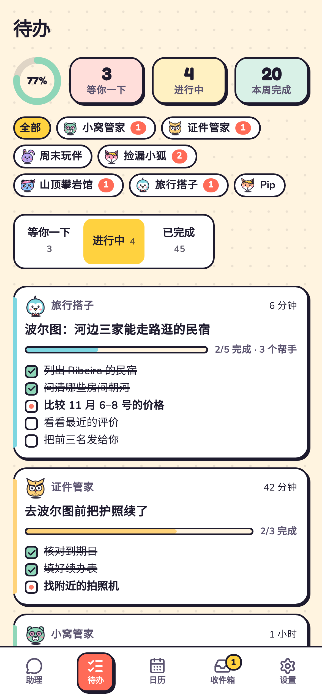
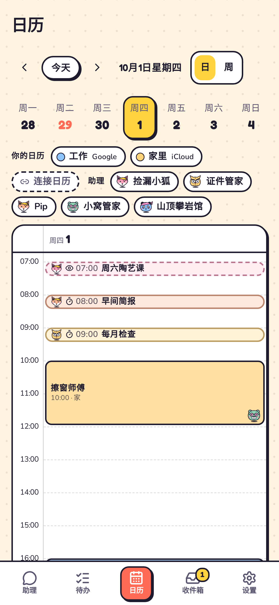

<div align="center">


# OpenDot

### 你在现实世界里的私人助理团队。

每个助理只管一件事，用自己的邮箱、电话和电脑，以自己的身份跟外面打交道，<br/>
等到需要你拿主意时才来找你。**你只需要回应。**

[](LICENSE)
[](#-三步开始)
[](README.md)

[English](README.md) · **中文**


**💳 钱永远是你的。** 助理从不花钱：它们把一切准备好，把链接交给你。

</div>

---

## ✨ 六个想法

<table>
<tr>
<td width="46%" valign="top">

### 1 · 助理主动，你只管回应
它们一直替你盯着，有眉目了才来找你，你点一下就行。默认安静。

</td>
<td width="54%"></td>
</tr>
<tr>
<td width="54%"></td>
<td width="46%" valign="top">

### 2 · 每个助理都有自己的电脑
浏览器、文件和终端，你可以实时围观，也可以随时接手。活儿多时它会叫帮手，每个帮手也有自己的电脑。

</td>
</tr>
<tr>
<td width="46%" valign="top">

### 3 · 在现实世界里有自己的身份
每个助理都可以有自己的邮箱和电话号码，以自己的身份跟外面打交道，而不是冒充你。

<sub>邮箱的做法是：你交给助理们一个邮箱，每个助理在上面有一个别名地址（比如 <code>you+pip@gmail.com</code>）。最好专门新开一个邮箱给它们，这样它们永远碰不到你的私人邮件。</sub>

</td>
<td width="54%"></td>
</tr>
<tr>
<td width="54%"></td>
<td width="46%" valign="top">

### 4 · 二维码、链接，就是一个助理
一件事一个助理。一句话、一个模板、一个链接或一个二维码，就能建一个。

</td>
</tr>
<tr>
<td width="46%" valign="top">

### 5 · 助理日历
你的日程和助理的安排在同一条时间线上，有人在管的日程上会有它的小头像。

</td>
<td width="54%"></td>
</tr>
<tr>
<td width="54%"></td>
<td width="46%" valign="top">

### 6 · 助理待办
它们接下的所有事，一块看板看完：等你、进行中、已完成。

</td>
</tr>
</table>

<p align="center">

&nbsp;

</p>


---

## 🛡️ 一切由你做主

- **不经你同意，不会以你的名义发出任何东西。** 邮件、短信、帖子都要你点头，发出前还会再检查一遍。
- **有些事永远由你亲自来：** 付钱、改密码、注销账号、签合同。
- **应用只交给你指定的助理。** 它们可以在里面查东西；要新增或改动任何内容都会先问你。
- **数据都在你自己的电脑上**，是你能直接打开看的普通文件。
- **电脑重启也不丢活。**

---

## 🦊 头像和配色


---

## 🚀 三步开始

```bash
git clone https://github.com/thinkwee/OpenDot && cd OpenDot
./dot.sh
```

它会装好所有东西，问你用哪个 AI，然后在浏览器里打开 OpenDot。想在手机上用，再运行 `./dot.sh link`。

然后在 **设置 → 应用** 里连上你常用的应用：Notion、Gmail、Google 日历或 iCloud 日历、Outlook、Todoist、飞书文档、高德地图等等，大多一键就好。

支持 macOS 和 Linux，任意 AI 模型都行：OpenAI、Claude、Gemini、DeepSeek，或者跑在你自己电脑上的模型。中英双语。

更多：[它是怎么工作的](docs/DESIGN.md)。

---

## 🧭 这类个人助理，和我们的开源尝试

个人助理并不是新鲜事，但 2026 年 9 月的这一波，让它向现实生活又迈进了一步：**Meta Muse**、**Manus Cue** 和 **OpenAI Dot** 都让助理带着自己的电脑在后台替人做事，有的还给每个助理配了自己的邮箱和电话号码。

OpenDot 是一个独立的开源项目：一支活在现实世界里的私人助理团队，由你自己运行。你的电脑、你的模型、你的数据。本项目与以上任何公司都没有关联。

---

<div align="center">

**还很早期，我们坦诚说明。** 如果助理们帮你卸下了点什么，点一颗 ⭐，它们会开心地跳舞。


<sub>MIT © 2026 thinkwee</sub>

</div>
